# GoFundBot 系统架构文档

> 本文档使用 Mermaid 图表描述 GoFundBot 的整体架构、前端架构、后端架构、AI 架构及数据流。

---

## 1. 系统总体架构

三服务独立部署，通过 HTTP REST JSON 通信：

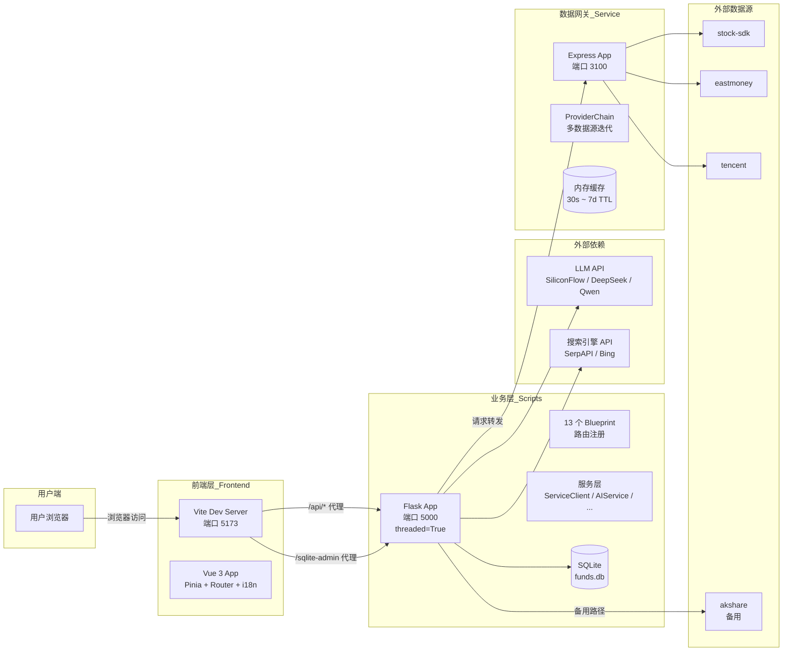

### 环境变量控制

| 变量 | 作用 |
|------|------|
| `FUND_DEFAULT_SOURCE` | 数据源策略：`data_service` / `auto` / `legacy` |
| `CORS_ORIGINS` | 跨域白名单 |
| `ENABLE_SQLITE_ADMIN` | SQLite 管理后台开关 |
| `DISABLE_AKSHARE_FALLBACK` | 禁用 akshare 备用路径 |

---

## 2. 前端架构

### 2.1 技术栈

- **框架**: Vue 3 (Composition API, `<script setup lang="ts">`)
- **构建**: Vite 5
- **路由**: Vue Router (Hash 模式)
- **状态管理**: Pinia
- **国际化**: vue-i18n (zh-CN / en)
- **UI 组件**: VXETable, ECharts, Lucide Icons
- **HTTP**: Axios

### 2.2 应用壳结构

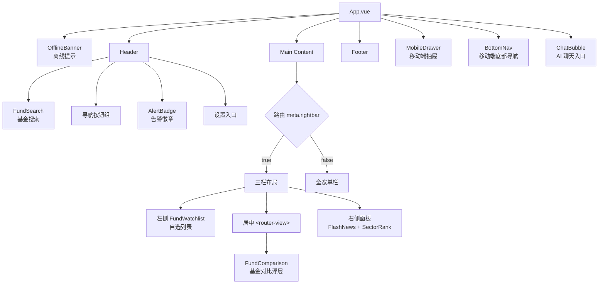

### 2.3 路由配置

| 路径 | 视图组件 | 布局 | 说明 |
|------|----------|------|------|
| `/` | `DashboardView` | 三栏 | 市场仪表盘 |
| `/fund/:code` | `FundDetailView` | 三栏 | 基金详情 |
| `/index/:code` | `IndexDetailView` | 三栏 | 指数详情 |
| `/screening` | `ScreeningView` | 全宽 | 基金筛选 |
| `/backtest/:code?` | `BacktestView` | 全宽 | 定投回测 |
| `/portfolio` | `PortfolioView` | 全宽 | 我的持仓 |
| `/research` | `ResearchView` | 全宽 | 投研中心 |
| `/settings` | `SettingsView` | 全宽 | 嵌套设置页 |

### 2.4 Pinia Store

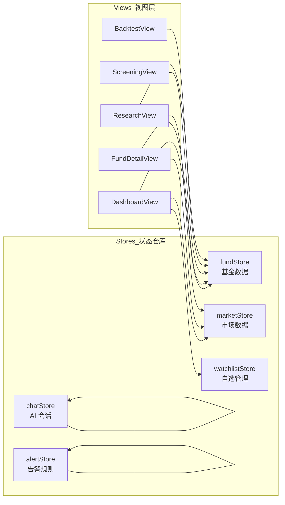

### 2.5 Composables 分类

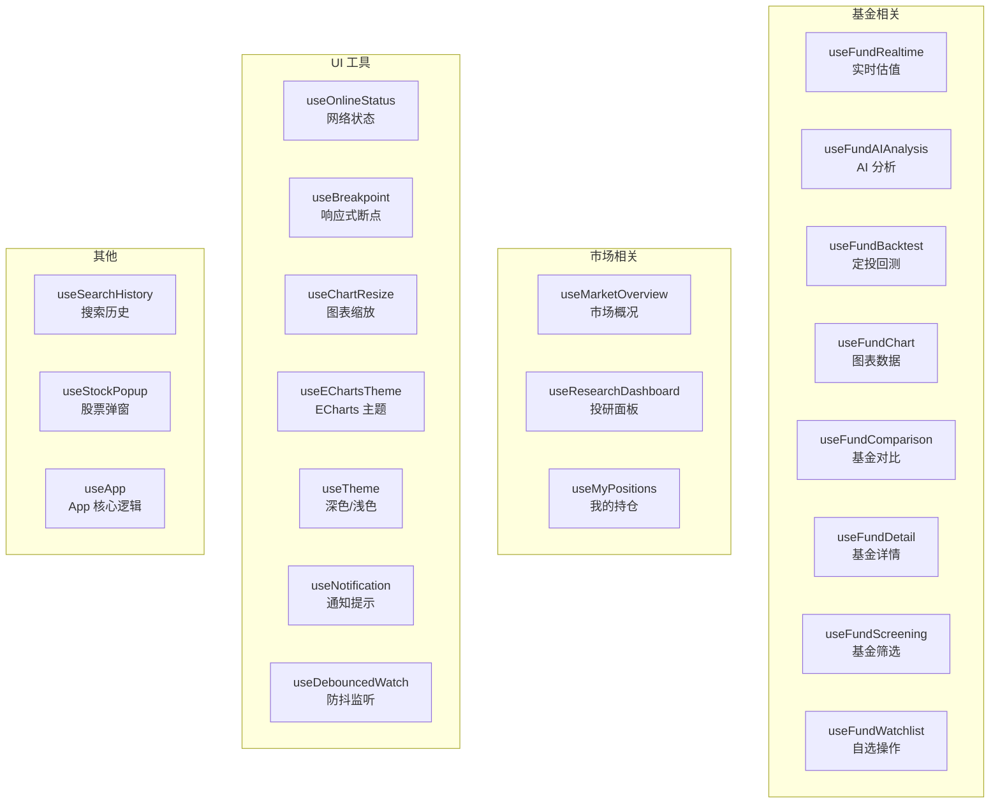

### 2.6 API 服务层

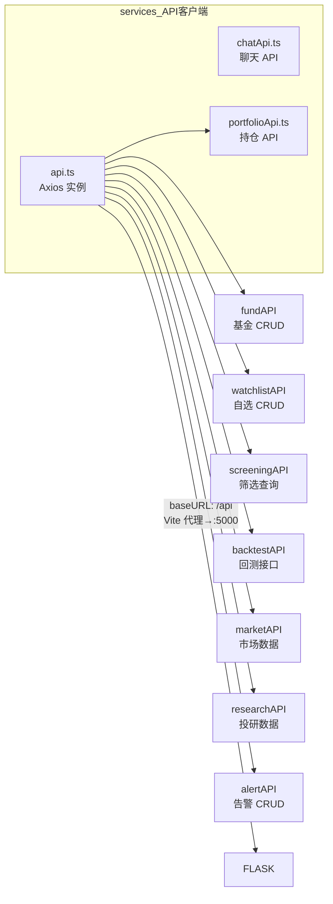

---

## 3. 后端架构

### 3.1 Flask Blueprint 注册全景

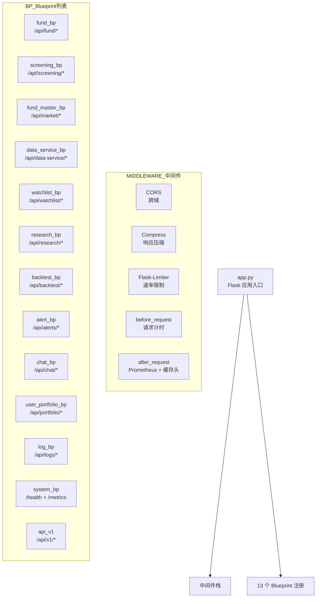

### 3.2 路由包详解

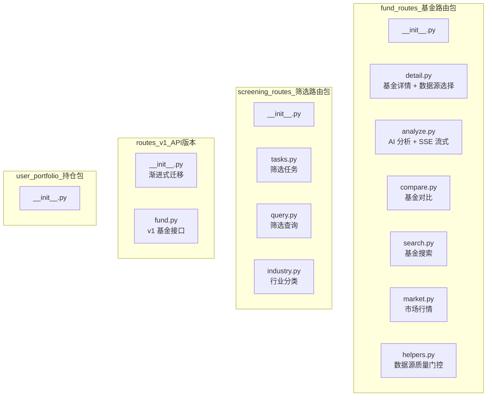

### 3.3 服务层全景

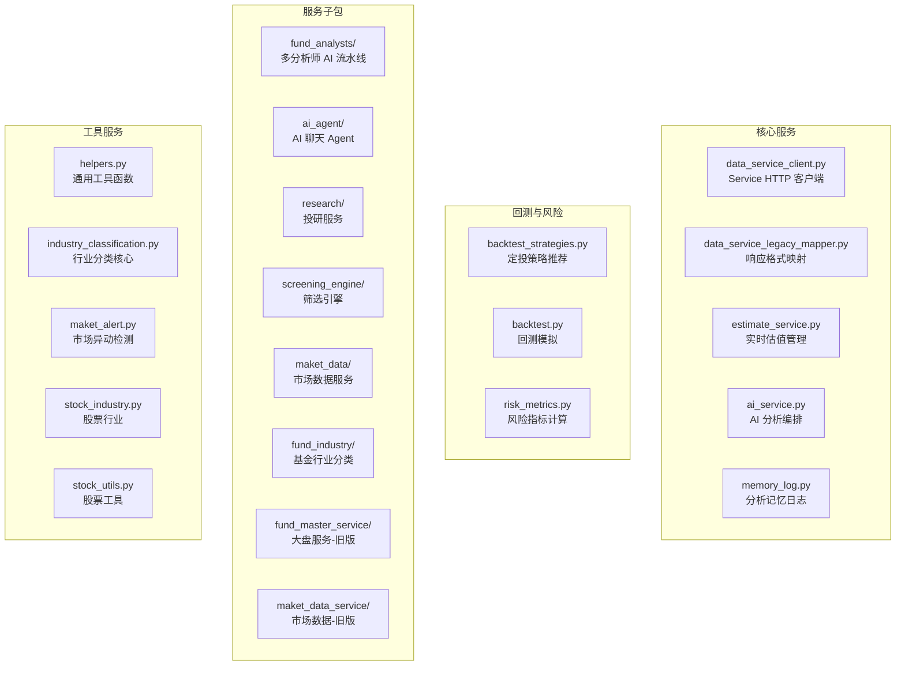

### 3.4 配置与基础设施

```mermaid
flowchart LR
    subgraph config_配置
        C[config.py<br/>Config 单例<br/>LLM / Service / Search 密钥]
        C -->|启动时校验| VALIDATE[validate()]
    end

    subgraph core_核心模块
        LOG[logging.py<br/>结构化 JSON 日志<br/>requestId]
        MET[metrics.py<br/>Prometheus 指标]
        VLD[validation.py<br/>@validate_body / @validate_query]
        VER[version_shim.py<br/>@deprecated_route 装饰器]
        CACHE_H[cache_headers.py<br/>缓存头控制]
        CORS_C[cors_config.py<br/>CORS 配置]
    end

    subgraph schemas_校验模型
        AS[analysis_schemas.py<br/>Rating / DashboardEval / AnalystReport]
        ALS[alert_schemas.py<br/>告警规则校验]
        BTS2[backtest_schemas.py<br/>回测参数]
        API_DOC[apidoc.py<br/>Swagger 模型]
    end
```

---

## 4. AI 架构

### 4.1 多分析师并行流水线

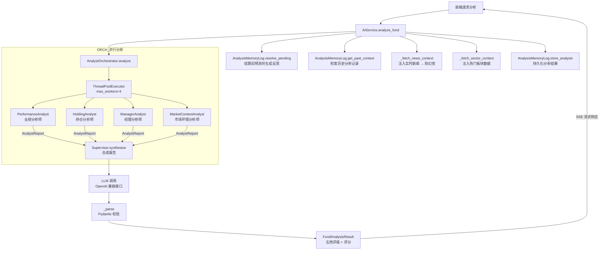

### 4.2 分析师类层次

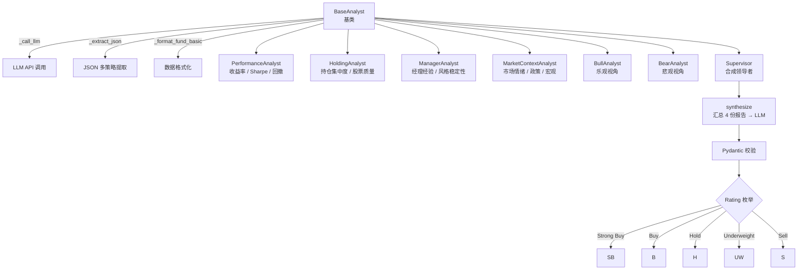

### 4.3 分析记忆反射闭环

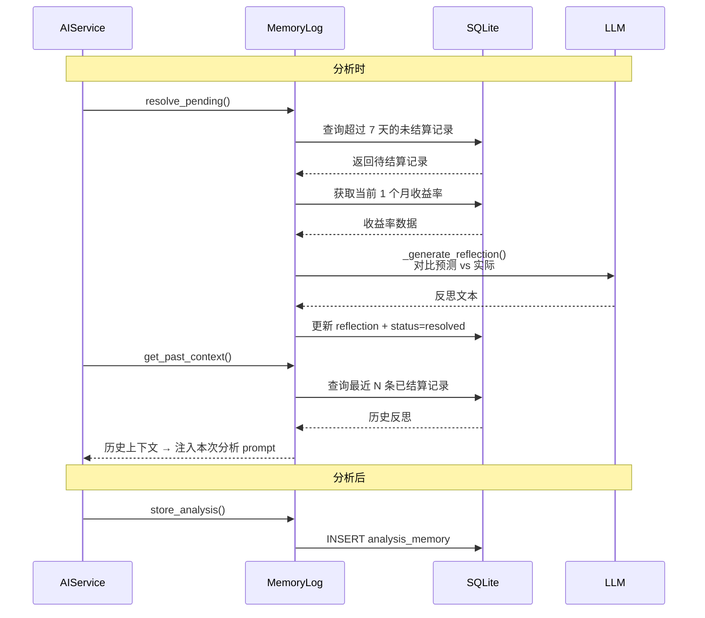

### 4.4 AI 聊天 Agent

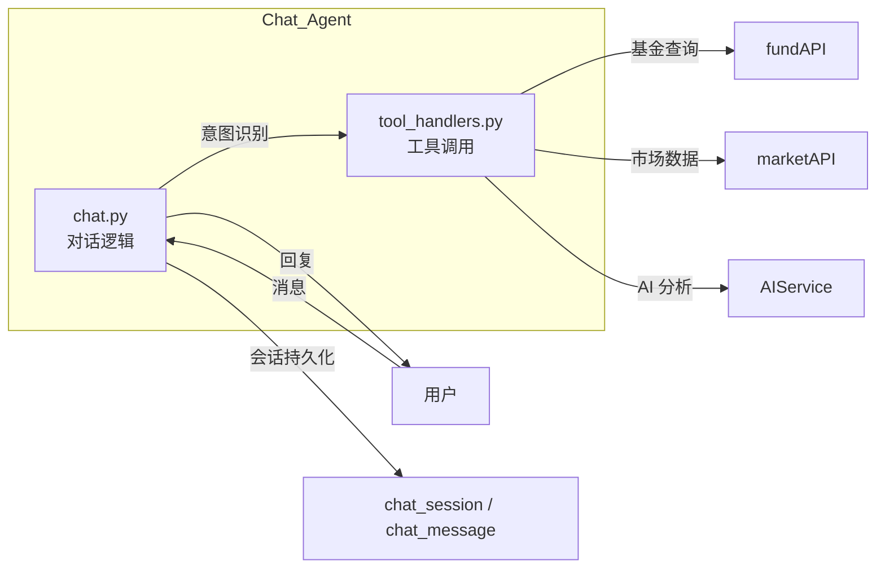

---

## 5. 数据流

### 5.1 基金详情请求全链路

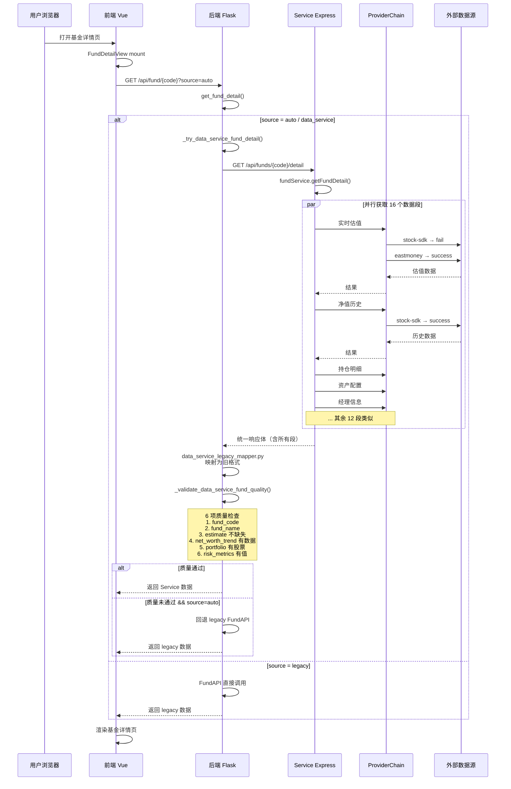

### 5.2 ProviderChain 模式

```mermaid
flowchart TD
    subgraph ProviderChain_迭代器模式
        PC[ProviderChain&lt;P&gt;] --> ITER[run(operation, invoke)]
        ITER --> FOR[for each provider]
        FOR --> TRY{invoke 成功?}
        TRY -->|是| RET[返回结果<br/>result.fallback = false]
        TRY -->|否| LOG[记录错误<br/>继续下一个]
        LOG --> FOR
        FOR -->|全部失败| THROW[抛出 AppError]
    end

    subgraph Providers_提供者
        SS[StockSdkFundProvider<br/>stock-sdk]
        EM[EastMoneyFundProvider<br/>eastmoney]
        EM2[EastMoneyMarketProvider<br/>eastmoney]
        TC[TencentStockProvider<br/>tencent]
    end

    subgraph Service_消费者
        FS[fundService.ts]
        MS[maketService.ts]
    end

    FS --> PC
    MS --> PC
    PC --> SS
    PC --> EM
    PC --> TC
```

### 5.3 缓存策略

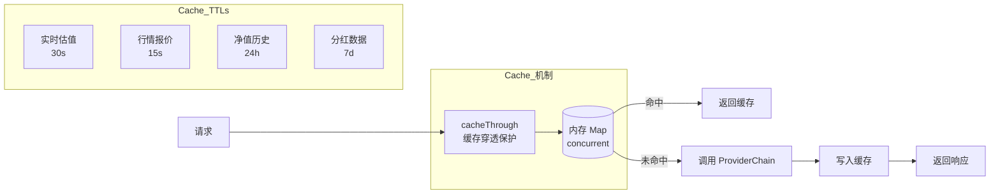

---

## 6. 数据库 ER 图

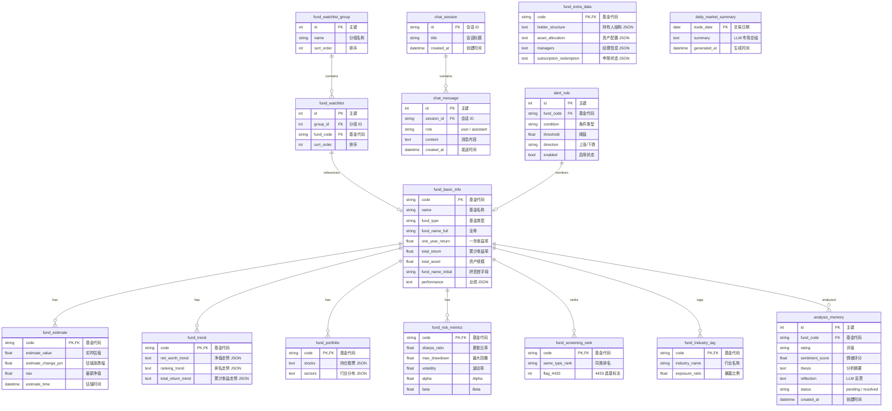

---

## 附录：关键文件一览

| 文件路径 | 行数 | 作用 |
|----------|------|------|
| `Scripts/app.py` | 278 | Flask 应用入口，Blueprint 注册，中间件 |
| `Scripts/ai_service.py` | 550 | AI 分析编排器 |
| `Scripts/services/data_service_client.py` | 277 | Service HTTP 客户端 |
| `Scripts/services/memory_log.py` | 183 | 分析记忆日志与 LLM 反射 |
| `Scripts/services/fund_analysts/orchestrator.py` | 99 | 多分析师并行编排 |
| `Scripts/services/fund_analysts/supervisor.py` | 105 | 合成报告 Supervisor |
| `Scripts/models.py` | 530+ | SQLAlchemy 数据模型 |
| `Service/src/app.ts` | 77 | Express 应用配置 |
| `Service/src/services/fundService.ts` | 545 | 基金数据服务（ProviderChain 调度） |
| `Service/src/core/providerChain.ts` | 64 | ProviderChain 迭代理器 |
| `Frontend/src/App.vue` | 111 | 应用壳布局 |
| `Frontend/src/router/index.ts` | 86 | 7 条路由配置 |
| `Frontend/src/services/api.ts` | 134 | Axios API 客户端 |
